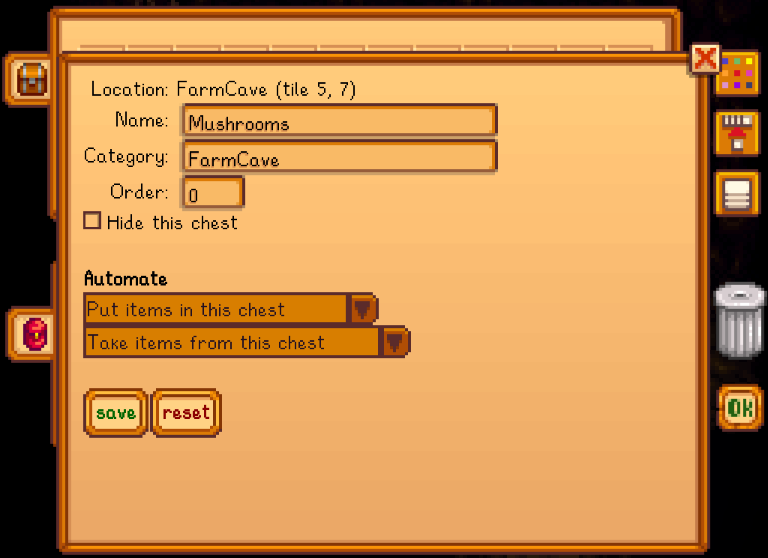
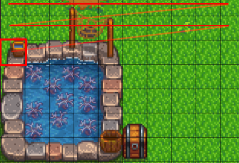
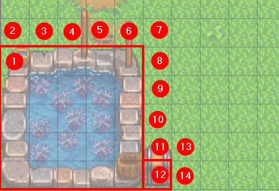
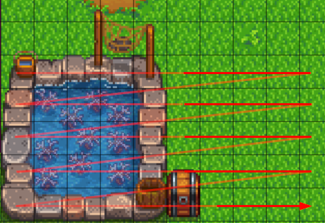

This document provides technical info about the Automate mod. **For more general info, see the
[README](README.md) file instead.**

## Contents
* [FAQs](#faqs)
* [Basic extensibility for mod authors](#basic-extensibility-for-mod-authors)
  * [Custom chest types](#custom-chest-types)
  * [Custom chest capacity](#custom-chest-capacity)
  * [Chest automation options](#chest-automation-options)
* [Advanced extensibility for mod authors](#advanced-extensibility-for-mod-authors)
  * [APIs](#apis)
  * [Patch Automate](#patch-automate)
* [Implementation details](#technical-details)
  * [Core concepts](#core-concepts)
  * [Machine logic](#machine-logic)
  * [Machine scanning](#machine-scanning)
  * [Discovery order](#discovery-order)
* [See also](#see-also)

## FAQs
### What's the order of processed machines?
See [_machine priority_ in the README](README.md#machine-priority).

### What's the order of items taken from chests?
For each machine, the available chests are scanned until Automate finds enough items to fill a
recipe for that machine. If multiple chests are connected, they're essentially combined into one
inventory in [discovery order](#discovery-order) (so items may be taken from multiple chests
simultaneously).

For example, let's say you have one chest containing these item stacks:
```
1× coal
3× copper ore
3× iron ore
2× copper ore
2× iron ore
```

A furnace has two recipes with those ingredients: `coal` + `5× copper ore` = `copper bar`, and
`coal` + `5× iron ore` = `iron bar`. Automate will scan the items from left to right and top to bottom,
and collect items until it has a complete recipe. In this case, the furnace will start producing a
copper bar:

1. Add `coal` from first stack (two unfinished recipes):  
   ❑ `coal` + `0 of 5× copper ore` = `copper bar`  
   ❑ `coal` + `0 of 5× iron ore` = `iron bar`
2. Add `3× copper ore` from second stack (two unfinished recipes):  
   ❑ `coal` + `3 of 5× copper ore` = `copper bar`  
   ❑ `coal` + `0 of 5× iron ore` = `iron bar`
3. Add `3× iron ore` from third stack (two unfinished recipes):  
   ❑ `coal` + `3 of 5× copper ore` = `copper bar`  
   ❑ `coal` + `3 of 5× iron ore` = `iron bar`
4. Add `2× copper ore` from fourth stack (one recipe filled):  
   ✓ `coal` + `5× copper ore` = `copper bar`  
   ❑ ~~`coal` + `3 of 5× iron ore` = `iron bar`~~

</details>

### Which chest will machine output go into?
The connected chests are prioritised in this order:

1. chests with the "Put items in this chest first" option (see [_in-game settings_ in the README](README.md#in-game-settings));
2. chests which already contain an item of the same type;
3. any chest.

Chests with the same priority are sorted by [discovery order](#discovery-order).

### Can I change in-game settings without Chests Anywhere?
Normally you'd change how chests are automated through [Chests Anywhere](https://www.nexusmods.com/stardewvalley/mods/518)'s
chest options UI:
> 

If you don't want Chests Anywhere's functionality, you have a few options:

* You can install Chests Anywhere, but set the `"Range": "None"` option in its `config.json`. That
  will let you edit an opened chest, but you won't have any option to navigate chests or open them
  remotely.
* _Or_ you can install Chests Anywhere temporarily, set the options you want and save, then remove
  it. The options will still work after it's uninstalled.
* _Or_ you can [edit your save file](https://stardewvalleywiki.com/Saves#Edit_a_save) manually and
  [set the chest options directly](#chest-automation-options). That's more complicated, but you
  can ask for help in [#making-mods on Discord](https://smapi.io/community#Discord) if you're
  interested.

## Basic extensibility for mod authors
### Custom chest types
Automate automatically recognizes the vanilla chests as storage containers. To add a new chest type to Automate, you
need to:
1. use the `Chest` object type;
2. and add the `automate_storage` context tag to its [object data](https://stardewvalleywiki.com/Modding:Objects).

This will also let players configure the chest in the config UI automatically.

### Custom chest capacity
Automate uses the value returned by `chest.GetActualCapacity()`. You can override or patch that method, and Automate
will update automatically.

### Chest automation options
You can change how Automate uses an individual chest by editing its `modData` field (e.g. to hide it from Automate). See
[_mod integrations_ in the Chests Anywhere docs](../../ChestsAnywhere/docs/README.md#mod-integrations) for more info.

## Advanced extensibility for mod authors
See _[core concepts](#core-concepts)_ before reading this section.

### APIs
Automate has a [mod-provided API](https://stardewvalleywiki.com/Modding:Modder_Guide/APIs/Integrations#Mod-provided_APIs)
you can use to add custom machines, containers, and connectors.

#### Access the API
To access the API:

1. Add a reference to the `Automate.dll` file. Make sure it's [_not_ copied to your build output](https://smapi.io/package/how-do-i-change-which-files-are-included-in-the-mod-deployzip).
2. Hook into [SMAPI's `GameLoop.GameLaunched` event](https://stardewvalleywiki.com/Modding:Modder_Guide/APIs/Events#GameLoop.GameLaunched)
   and get a copy of the API:
   ```c#
   IAutomateAPI automate = this.Helper.ModRegistry.GetApi<IAutomateAPI>("Pathoschild.Automate");
   ```
3. Use the API to extend Automate (see below).

#### Add connectors and machines
You can add automatables by implementing an `IAutomationFactory`. Automate will handle the core
logic (like finding entities, linking automatables into groups, etc); you just need to return the
automatable for a given entity. You can't change the automation for an existing automatable though;
if Automate already has an automatable for an entity, it won't call your factory.

> [!TIP]
> To add new chest items as storage, see [_add custom chest types_](#add-custom-chest-types) instead if
> possible. Chests added through an automation factory won't be configurable by the player.

First, let's create a basic machine that transmutes an iron bar into gold in two hours:

```c#
using Microsoft.Xna.Framework;
using Pathoschild.Stardew.Automate.Framework;
using StardewValley;
using SObject = StardewValley.Object;

namespace YourModName
{
    /// <summary>A machine that turns iron bars into gold bars.</summary>
    public class TransmuterMachine : IMachine
    {
        /*********
        ** Fields
        *********/
        /// <summary>The underlying entity.</summary>
        private readonly SObject Entity;


        /*********
        ** Accessors
        *********/
        /// <summary>The location which contains the machine.</summary>
        public GameLocation Location { get; }

        /// <summary>The tile area covered by the machine.</summary>
        public Rectangle TileArea { get; }

        /// <summary>A unique ID for the machine type.</summary>
        /// <remarks>This value should be identical for two machines if they have the exact same behavior and input logic. For example, if one machine in a group can't process input due to missing items, Automate will skip any other empty machines of that type in the same group since it assumes they need the same inputs.</remarks>
        string MachineTypeID { get; } = "YourModId/Transmuter";


        /*********
        ** Public methods
        *********/
        /// <summary>Construct an instance.</summary>
        /// <param name="entity">The underlying entity.</param>
        /// <param name="location">The location which contains the machine.</param>
        /// <param name="tile">The tile covered by the machine.</param>
        public TransmuterMachine(SObject entity, GameLocation location, in Vector2 tile)
        {
            this.Entity = entity;
            this.Location = location;
            this.TileArea = new Rectangle((int)tile.X, (int)tile.Y, 1, 1);
        }

        /// <summary>Get the machine's processing state.</summary>
        public MachineState GetState()
        {
            if (this.Entity.heldObject.Value == null)
                return MachineState.Empty;

            return this.Entity.readyForHarvest.Value
                ? MachineState.Done
                : MachineState.Processing;
        }

        /// <summary>Get the output item.</summary>
        public ITrackedStack GetOutput()
        {
            return new TrackedItem(this.Entity.heldObject.Value, onEmpty: item =>
            {
                this.Entity.heldObject.Value = null;
                this.Entity.readyForHarvest.Value = false;
            });
        }

        /// <summary>Provide input to the machine.</summary>
        /// <param name="input">The available items.</param>
        /// <returns>Returns whether the machine started processing an item.</returns>
        public bool SetInput(IStorage input)
        {
            if (input.TryGetIngredient(SObject.ironBar, 1, out IConsumable ingredient))
            {
                ingredient.Take();
                this.Entity.heldObject.Value = ItemRegistry.Create<SObject>(SObject.goldBarQID);
                this.Entity.MinutesUntilReady = 120;
                return true;
            }

            return false;
        }
    }
}
```

Next, let's create a factory which returns the new machine. This example assumes you've added an
in-game object with ID `Example.ModId_Transmuter` that you want to automate.

```c#
using Microsoft.Xna.Framework;
using StardewValley;
using StardewValley.Buildings;
using StardewValley.Locations;
using StardewValley.TerrainFeatures;
using SObject = StardewValley.Object;

namespace YourModName
{
    public class MyAutomationFactory : IAutomationFactory
    {
        /// <summary>Get a machine, container, or connector instance for a given object.</summary>
        /// <param name="obj">The in-game object.</param>
        /// <param name="location">The location to check.</param>
        /// <param name="tile">The tile position to check.</param>
        /// <returns>Returns an instance or <c>null</c>.</returns>
        public IAutomatable GetFor(SObject obj, GameLocation location, in Vector2 tile)
        {
            if (obj.QualifiedItemId == "(BC)Example.ModId_Transmuter")
                return new TransmuterMachine(obj, location, tile);

            return null;
        }

        /// <summary>Get a machine, container, or connector instance for a given terrain feature.</summary>
        /// <param name="feature">The terrain feature.</param>
        /// <param name="location">The location to check.</param>
        /// <param name="tile">The tile position to check.</param>
        /// <returns>Returns an instance or <c>null</c>.</returns>
        public IAutomatable GetFor(TerrainFeature feature, GameLocation location, in Vector2 tile)
        {
            return null;
        }

        /// <summary>Get a machine, container, or connector instance for a given building.</summary>
        /// <param name="building">The building.</param>
        /// <param name="location">The location to check.</param>
        /// <param name="tile">The tile position to check.</param>
        /// <returns>Returns an instance or <c>null</c>.</returns>
        public IAutomatable GetFor(Building building, GameLocation location, in Vector2 tile)
        {
            return null;
        }

        /// <summary>Get a machine, container, or connector instance for a given tile position.</summary>
        /// <param name="location">The location to check.</param>
        /// <param name="tile">The tile position to check.</param>
        /// <returns>Returns an instance or <c>null</c>.</returns>
        /// <remarks>Shipping bin logic from <see cref="Farm.leftClick"/>, garbage can logic from <see cref="Town.checkAction"/>.</remarks>
        public IAutomatable GetForTile(GameLocation location, in Vector2 tile)
        {
            return null;
        }
    }
}
```

And finally, add your factory to the automate API (see [_access the API_](#access-the-api) above):

```c#
IAutomateAPI automate = ...;
automate.AddFactory(new MyAutomationFactory());
```

That's it! When Automate scans a location for automatables, it'll call your `GetFor` method and add
your custom machine to its normal automation.

### Patch Automate
When all else fails, you can patch Automate's logic
[using Harmony](https://stardewvalleywiki.com/Modding:Modder_Guide/APIs/Harmony).

To simplify patching, Automate also wraps all machines with a
[`MachineWrapper`](Framework/MachineWrapper.cs) instance, so you can hook one place to change any
machine's input, output, or processing logic. For example, you can patch `GetOutput` to adjust
machine output, `SetInput` to add custom recipes if none of the vanilla recipes matched, etc.

Before you patch Automate, please consider these best practices:

1. **This is strongly discouraged in most cases.** Patching Automate makes both Automate and your
   mod more fragile and likely to break. Only do this if you can't do it any other way.

2. Inside your patch methods, **wrap the code in a `try..catch` and log your own exception**. That
   way players won't report errors on the Automate page instead. You should also fallback to
   running the original method, so errors in your code don't break Automate.

3. When your mod starts, log a clear message indicating that your mod patches Automate. This
   simplifies troubleshooting and avoids confusion. For example:

   ```c#
   if (helper.ModRegistry.IsLoaded("Pathoschild.Automate"))
      this.Monitor.Log("This mod patches Automate. If you notice issues with Automate, make sure it happens without this mod before reporting it to the Automate page.", LogLevel.Debug);
   ```

   It doesn't have to be player-visible, even a `TRACE`-level message is useful when helping a
   player troubleshoot.

## Implementation details
This section provides a view of Automate's inner workings for the curious. You can safely skip it
if you're not interested.

### Core concepts
These are the core concepts in the Automate design used in the rest of the technical details:

<dl>
<dt>Entity</dt>
<dd>A placed item, terrain feature, building, or other in-game thing.</dd>

<dt>Connector</dt>
<dd>Something which can be added to a machine group (thus extending its range), but otherwise has
no logic of its own. It has no state, input, or output.</dd>

<dt>Container</dt>
<dd>Something which stores and retrieves items (usually a chest).</dd>

<dt>Machine</dt>
<dd>Something which has a state (e.g. empty or processing) and accepts input, provides output, or
both. This doesn't need to be a 'machine' in the gameplay sense; Automate provides default machines
for shipping bins and fruit trees, for example.</dd>

<dt>Machine group</dt>
<dd>

A set of machines, containers, and connectors which are chained together. You can press `U` in-game
(configurable) to see machine groups highlighted in green. For example, these are two machine groups:  


</dd>
</dl>

### Machine logic
The game has no concept of machines. For example, nothing prevents a pumpkin from producing output,
the game is just hardcoded to detect when the player interacts with certain object types to set
their output. Trash cans and the default shipping bin don't even exist in-game, except as tiles on
the map.

Automate handles this by wrapping entities into machine instances. These reuse game logic when
possible, but usually they need to reimplement it in an automateable way. For example, the logic
for kegs is implemented by [`KegMachine`](Framework/Machines/Objects/KegMachine.cs). See
[`Framework/Machines` in Automate's code](Framework/Machines) for a list of machines directly
supported by Automate.

To map entities to machines/containers/connectors, Automate defines a default _automation factory_ —
a standardized way to get a container/machine/connector from a tile/object/building/terrain feature.
An automation factory essentially has logic like this:

```c#
if (building is FishPond pond)
    return new FishPondMachine(pond, location);
if (building is Mill mill)
    return new MillMachine(mill, location);
...
```

Other mods can add their own automation factories, to enable automation for their own machines. See
_[APIs](#apis)_ above for an example automation factory and machine instance.

### Machine scanning
Scanning is when Automate collects all the entities in a location and combines them into machine
groups for automation. This has a few steps:

<dl>
<dt>1. Index the location.</dt>
<dd>

The game doesn't have an efficient way to know if a tile is covered by some entities, like
buildings. You need to iterate through the building list, calculate each building's area from its
position and size, and see if that area contains the tile. Each location can have tens of thousands
of tiles, so doing that for each tile can cause noticeable lag for players.

So Automate first creates an optimized lookup for the location's entities by tile position,
internally called the _index_. For example:

<table>
<tr>
<th>machine layout</th>
<th>index</th>
</tr>
<tr>
<td>


</td>
<td>

```
(31, 11) ────────┐
(32, 11) ────────┤
(33, 11) ────────┤
(34, 11) ────────┤
(35, 11) ────────┼────> Fish Pond
(36, 11) ────────┤
(31, 12) ────────┤
...              │
(36, 15)─────────┘
(36, 16)──────────────> Chest
```

</td>
</table>

Note that the index _only_ cares about tile positions, it has no concept of connections between the
fish pond and chest.


</dd>
<dt>2. Find a connected tile.</dt>
<dd>

Automate checks each tile on the map looking for an entity in the index. It starts from the top-left
corner, works its way to the right, then wraps to the left edge of the next row. It does this until
it encounters a valid chest, machine, or connector.

For example, Automate will find a connected entity (the fish pond) on tile `(31, 11)`:



</dd>
<dt>3. Flood fill machine group.</dt>
<dd>

Next Automate collects all the entities connected (directly or indirectly) to that tile. It does
this using an entity-aware [flood fill algorithm](https://en.wikipedia.org/wiki/Flood_fill). Here
_entity-aware_ means it knows that `(31, 11)` is part of a larger entity covering multiple tiles
(so it doesn't need to scan those tiles separately), and flood fill is an approach where it
recursively scans all the tiles around a matching tile.

For example, here's how Automate would scan the tiles:



At that point it can build a machine group, which represents an optimized view of the entities:
```
{
   Machines: [ FishPond ],
   Containers: [ Chest ],
   Tiles: [ (31, 11), (32, 11), (33, 11), ..., (36, 16) ],
   HasInternalAutomation: true
}
```

Notes:
* Once a machine group is constructed, the tile positions of each machine and container are no
  longer relevant; it's just a list of machines/containers that are linked together.
* Machine priority is applied here (it's just a sort on the machine list).
* The `HasInternalAutomation` flag indicates whether the machine can be automated. For example, a
  group containing a chest but no machines can't be automated, so the group will just be discarded
  when Automate finishes scanning.

(This works for any number of connected entities, not just two like in this example.)

<dt>4. Resume from step 2.</dt>
<dd>

Finally Automate resumes from step 2 until all tiles in the location have been scanned, skipping
tiles that have already been visited:



</dd>
</dl>

### Discovery order
Discovery order is the order that Automate finds entities when [scanning a location](#machine-scanning).
This affects the order of many other things. For example, the order that machines process recipes is
directly linked to the discovery order of their connected chests.

## See also
* [README](README.md) for general info
