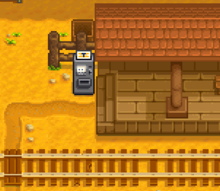
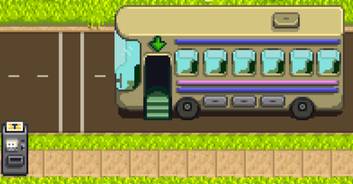
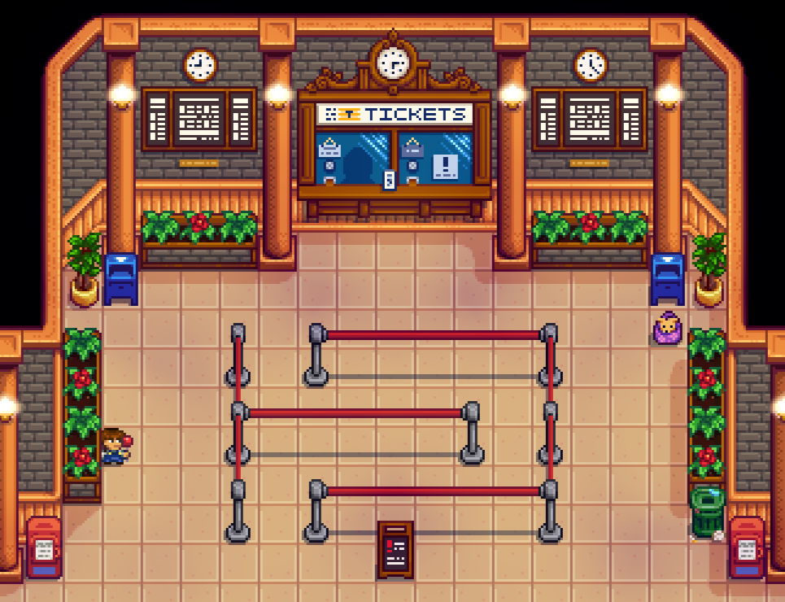

**Central Station** lets you travel to other mods' destinations by boat, bus, or train. You can also get a ticket to
the Central Station to change line, visit the gift shop, and more.

Mod authors can add custom destinations with optional ticket prices, add ticket machines to their locations, and extend
the Central Station location with their own content like tourists and bookshelf messages.

## Contents
* [For players](#for-players)
  * [Install](#install)
  * [Buy a ticket](#buy-a-ticket)
  * [Visit Central Station](#visit-central-station)
  * [Mod compatibility](#mod-compatibility)
  * [Reassign old content packs](#reassign-old-content-packs)
* [For mod authors](#for-mod-authors)
* [See also](#see-also)

## For players
### Install
1. [Install the latest version of SMAPI](https://smapi.io/).
2. Install [this mod from Nexus Mods](https://www.nexusmods.com/stardewvalley/mods/8000).
4. Run the game using SMAPI.

That's it! Mods which use Central Station will work automatically with it.

### Buy a ticket
You can take the boat, bus, or train by using the ticket machine at their respective locations:

* At the railroad next to the station:  
  
* At the bus stop:  
  
* In [Willy's boat dock](https://stardewvalleywiki.com/Fish_Shop#Willy.27s_Boat) once it's been repaired:  
  

You can also interact with ticket machines in various mod locations.

### Visit Central Station
You can get a free ticket to Central Station from any ticket machine.

From there, you can...
- get a ticket to any boat, bus, and train destination;
- take a break in the food court;
- visit the gift shop;
- talk to other tourists;
- browse the bookshelves;
- and more.

The Central Station can include custom content from other mods (like tourists and bookshelf messages). So the more mods
you have that use Central Station, the more you can see in the Central Station!



### Mod compatibility
There are no known conflicts with other mods.

Central Station automatically shows stops added through the Bus Locations and Train Station mods if they're installed
too.

### Reassign old content packs
Normally Bus Locations or Train Station content packs only work if you install their framework mod. However, you can
reassign them to Central Station to avoid needing to install Bus Locations or Train Station separately.

To do that:

1. Open the content pack's `manifest.json` file in a text editor.
2. Find the line that looks like this:
   ```json
   "ContentPackFor": {
      "UniqueID": "hootless.BusLocations"
   }
   ```
   Or like this:
   ```json
   "ContentPackFor": {
      "UniqueID": "Cherry.TrainStation"
   }
   ```
3. And change it to this:
   ```json
   "ContentPackFor": {
      "UniqueID": "Pathoschild.CentralStation"
   }
   ```

That's it! Now just launch the game, and the content pack will be loaded by Central Station directly.

> [!NOTE]  
> This section is **intended for players**. If you're a mod author, see [_for mod authors_](#for-mod-authors) to add a
> stop to Central Station in a non-obsolete way.

## For mod authors
See the [author guide](author-guide.md) for more info!

## See also
* [Release notes](release-notes.md)
