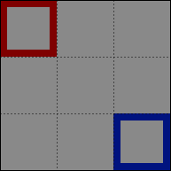
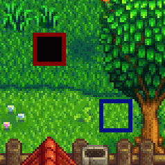
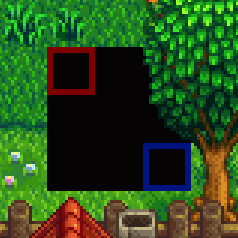
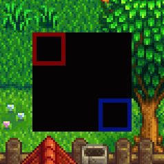

← [模组作者指南](../author-guide.md)

带有 **`"Action": "EditMap"`** 的补丁可以更改游戏已加载的地图的一部分。多个内容包可以编辑同一素材。您可以使用补丁向下和向右延伸地图（Content Patcher 会自动扩大地图以适应新地图）。

**🌐 其他语言：[en (English)](../../author-guide/action-editmap.md)。**

## 目录
* [介绍](#introduction)
  * [什么是地图？](#what-is-a-map)
* [用法](#usage)
  * [概述](#overview)
  * [公共字段](#common-fields)
  * [地图叠加](#overlay-a-map)
  * [编辑地图属性](#edit-map-properties)
  * [编辑地图图块](#edit-map-tiles)
* [已知限制](#known-limitations)
* [参见](#see-also)

## 介绍<a name="introduction"></a>
### 什么是地图？<a name="what-is-a-map"></a>
一个地图素材描述游戏内某个区域的的地形（水、悬崖、地面）、地形特征（灌木）、建筑、路径和特定区域的触发器。在您到达某个区域的边缘或进入建筑物时屏幕变黑时，意味着您正在两个地图间切换。

**请参阅 Wiki 上的[模组：地图](https://zh.stardewvalleywiki.com/模组:地图)**以更详细的了解地图和进阶概念。

## 用法<a name="usage"></a>
### 概述<a name="overview"></a>
每一个 `EditMap` 补丁可以对某一地图进行三种类型的更改：地图叠加、编辑地图属性或编辑地图图块。

由于三者差异较大，因此下文将分为三个部分详细描述这三种类型的更改，但它们仍可以在同一个补丁中组合使用。在这种情况下，字段按以下顺序应用：`FromFile`、`MapTiles`、`MapProperties`、`AddNpcWarps`、`AddWarps` 和 `TextOperations`。

### 公共字段<a name="common-fields"></a>
一个 `EditMap` 补丁由 `Changes`（请参阅下文[示例](#examples)）下的一个模型组成。不论更改类型是什么，都需要使用这些字段。

<dl>
<dt>必填字段：</dt>
<dd>

字段       | 用途
--------- | -------
`Action`  | 要进行的更改类型。此操作类型设置为 `EditMap`。
`Target`  | 要替换的目标[游戏素材名称](../author-guide.md#what-is-an-asset)（或多个由逗号分隔的素材名），例如 `Maps/Town`。该字段支持[令牌](../author-guide.md#tokens)，不区分大小写。

</dd>
<dt>可选字段：</dt>
<dd>

字段       | 用途
--------- | -------
`When`        | （可选）仅在给定的[条件](../author-guide.md#conditions)匹配时应用这个内容补丁。
`LogName`     | （可选）在日志中显示的补丁名称。这有助于查找错误。如果省略，则默认为类似 `EditMap Maps/Town` 的名字。
`Update`      | （可选）补丁字段的更新频率。请参阅[补丁更新频率](../author-guide.md#update-rate)。
`LocalTokens` | （可选）一组仅在此补丁中生效的[局部令牌](../author-guide/tokens.md#local-tokens)。


</dd>
<dt>进阶字段：</dt>
<dd>

<table>
  <tr>
    <td>字段</td>
    <td>用途</td>
  </tr>
  <tr>
  <td><code>Priority</code></td>
  <td>

（可选）当多个补丁编辑同一数据素材时，此字段控制它们应用的顺序。可用的值有 `Early`（更早），`Default`（默认），还有 `Late`（更晚）。默认值为 `Default`。

补丁（包括所有模组）按以下顺序生效：

1. 优先级从早到晚；
2. 按照模组加载顺序（基于依赖关系等因素）；
3. 按照补丁在 `content.json` 中列出的顺序。

如果需要更具体的顺序，可以使用简单的偏移量，如 `"Default + 2"` 或者 `"Late - 10"`。默认值为 -1000（`Early`），0（`Default`）和 1000（`Late`）。

此字段**不支持**令牌，不区分大小写。

> [!TIP]
> 优先级会让您的更改难以排除故障。推荐做法：
> * 如果可以的话，只使用上述无偏移的优先级（例如外观覆盖设为 `Late`）
> * 不需要为您自己的补丁设置优先级，因为您可以自己在 content.json 排列好补丁应用的顺序。

  </tr>
  <tr>
  <td><code>TargetLocale</code></td>
  <td>

（可选）素材名称中要匹配的地区代码，例如设置 `"TargetLocale": "fr-FR"` 将会只编辑法语的素材（例如 `Maps/Town.fr-FR`）。可以为空，只有只编辑没有地域区分的基本素材。

如果省略，则将应用于所有素材，不论其是否存在本地化。

</td>
</table>
</dd>
</dl>

您可以继续添加以下一个或多个部分的字段。

### 地图叠加<a name="overlay-a-map"></a>

一个“地图叠加”更改能够将图块、属性、和图块集从源地图复制到目标地图。目标区域下对应的图层将被源地图完全覆盖。

此补丁的字段为：

<table>
<tr>
<th>字段</th>
<th>用途</th>
</tr>
<tr>
<td>&nbsp;</td>
<td>

请参阅上文的[公共字段](#common-fields)章节。

</td>
</tr>
<tr>
<td>

`FromFile`

</td>
<td>

内容包文件夹中用于修补到目标中的文件的相对路径（例如 `assets/town.tmx`），或多个逗号分隔的路径。这可以是 `.tbin`，`.tmx`，或`.xnb` 文件。该字段支持[令牌](../author-guide.md#tokens)，不区分大小写。

Content Patcher 会按以下方法处理 `FromFile` 地图内引用的图块集：
* 若图块集没有被目标地图引用，Content Patcher 会帮您添加此图块集（并自动添加`z_` ID 前缀，以避免与硬编码的游戏逻辑冲突）。如果源地图具有已引用的图块集的自定义版本，则它将被添加为仅供您的图块使用的单独图块集。
* 如果您模组文件夹里包含您的图块集，Content Patcher 会自动使用它，否则它将从游戏的 `Content/Maps` 文件夹中加载。

</td>
</tr>
<tr>
<td>

`FromArea`

</td>
<td>

（可选）源地图中需要复制到目标地图的部分，默认为整个源地图。

此字段是一个对象，含有左上角点的 X 和 Y 像素坐标以及该区域的像素宽度（Width）和高度（Height）。该对象的字段支持[令牌](../author-guide.md#tokens)。

</td>
</tr>
<tr>
<td>

`ToArea`

</td>
<td>

（可选）目标图片中要替换的部分。默认大小与 `FromArea` 相同，锚点位于贴图的左上角。

此字段是一个对象，含有左上角点的 X 和 Y 像素坐标以及该区域的像素宽度（Width）和高度（Height）。该对象的字段支持[令牌](../author-guide.md#tokens)。

如果您指定的区域超出了地图的底部或右部，Content Patcher 会自动扩大地图以适应新地图。

</td>
</tr>
<tr>
<td>

`PatchMode`

</td>
<td>

（可选）如何将 `FromArea` 应用到 `ToArea`。默认为 `Replace`。

例如，假设您有一个大部分为空的源地图，包含两个图层：`Back`（红色）和`Buildings`（蓝色）：



以下是它们在不同 `PatchMode` 下的组合（黑色区域代表地图背后的空白图块，游戏内显示为黑色）：

* **`Overlay`**
  只替换对应的图块。`Back` 图层的红图块代替了 `Back` 图层的地面图块，而 `Buildings` 图层的蓝图块被添加到了 `Building` 图层，且没有替换任何 `Back` 图层的地面图块，所以地面依旧可见。
  

* **`ReplaceByLayer`**（默认）
  替换所有图块，但仅限于存在于源地图中的图层。
  

* **`Replace`**
  替换所有图块。
  

</td>
</tr>
</table>

例如，使用自定义地图内的图块替换鹈鹕镇广场：
```js
{
    "Format": "2.8.0",
    "Changes": [
        {
            "Action": "EditMap",
            "Target": "Maps/Town",
            "FromFile": "assets/town.tmx",
            "FromArea": { "X": 22, "Y": 61, "Width": 16, "Height": 13 },
            "ToArea": { "X": 22, "Y": 61, "Width": 16, "Height": 13 }
        },
    ]
}
```

### 编辑地图属性<a name="edit-map-properties"></a>
`MapProperties` 字段用于新增、替换或移除地图属性。

<table>
<tr>
<th>字段</th>
<th>用途</th>
</tr>
<tr>
<td>&nbsp;</td>
<td>

请参阅上文的[公共字段](#common-fields)章节。

</td>
</tr>

<tr>
<td>

`MapProperties`

</td>
<td>

需新增、替换或移除的地图属性（不同于图块属性）。要添加属性，只需要指定一个不存在的键；要删除属性，可以把它的值设为 `null`（例如 `"some key": null`）。

该字段的键和值都支持[令牌](../author-guide.md#tokens)。

</td>
</tr>

<tr>
<td>

`AddNpcWarps`  
`AddWarps`

</td>
<td>

在 [`NPCWarp` 或 `Warp` 地图属性](https://zh.stardewvalleywiki.com/模组:地图#传送和地图位置)里添加新的传送点，请仅在必要时创建该字段。如果多个传送点被添加到了同一图块上，那么最后添加的传送点将会生效。

该字段支持[令牌](../author-guide.md#tokens)。

</td>
</tr>

<tr>
<td>

`TextOperations`

</td>
<td>

`TextOperations` 字段可以编辑一个现有地图属性的值（请参阅[文本操作](../author-guide.md#text-operations)）。

`TextOperations` 在此处的 `Target` 路径只允许 `["MapProperties", "PropertyName"]`，其中 PropertyName 是要更改的地图属性名称。

</td>
</tr>
</table>

例如，此补丁更改农场洞穴的 `Outdoors` 地图属性，并增加一个传送点（传送格式请参阅 Wiki 上的[地图说明文档](https://zh.stardewvalleywiki.com/模组:地图)）
```js
{
    "Format": "2.8.0",
    "Changes": [
        {
            "Action": "EditMap",
            "Target": "Maps/FarmCave",
            "MapProperties": {
                "Outdoors": "T"
            },
            "AddWarps": [
                "10 10 Town 0 30"
            ]
        },
    ]
}
```

### 编辑地图图块<a name="edit-map-tiles"></a>
`MapTiles` 用于新增、编辑或移除图块和图块属性。

<table>
<tr>
<th>字段</th>
<th>用途</th>
</tr>
<tr>
<td>&nbsp;</td>
<td>

请参阅上文的[公共字段](#common-fields)章节。

</td>
</tr>

<tr>
<td>

`MapTiles`

</td>
<td>

需新增、编辑或移除的图块。该字段的所有子字段都支持[令牌](../author-guide.md#tokens)。

此字段是一个含有多个模型的列表。每一个模型对应一个图块，并含有以下字段。

字段 | 用途
----- | -------
`Layer` | (必填) 需更改的图块所在的[地图图层](https://zh.stardewvalleywiki.com/模组:地图#基本概念)。
`Position` | (必填) 需更改的图块所在的[图块坐标](https://zh.stardewvalleywiki.com/模组:地图#地块坐标)。您可以使用用 [Debug Mode 模组](https://www.nexusmods.com/stardewvalley/mods/679)在游戏内查看坐标。
`SetTilesheet` | (新增图块时必填，其他情况可选) 指定此图块的图块集 ID。
`SetIndex` | (新增图块时必填，其他情况可选) 指定此图块在图块集里的索引编号。
`SetProperties` | 要新增或移除的图块属性时，会和并到所有现有的图块属性中。若要删除属性，将值设置为 `null`（不能使用带有双引号的`"null"`！）。
`Remove` | (可选，默认为 `false`) 设置为 `true` 以删除此图块和该图块在当前图层上的所有属性。与别的字段同时使用时，原有图块会先被删除，随即新的图块会被创建。

</td>
</tr>
</table>

例如，此补丁延长农场里通向出货箱的路径，新增一个图块。
```js
{
    "Format": "2.8.0",
    "Changes": [
        {
            "Action": "EditMap",
            "Target": "Maps/Farm",
            "MapTiles": [
                {
                    "Position": { "X": 72, "Y": 15 },
                    "Layer": "Back",
                    "SetIndex": "622"
                }
            ]
        },
    ]
}
```

`MapTiles` 的所有子字段都支持[令牌](../author-guide.md#tokens)。例如，此补丁在出货箱前新增一个每天都会随机传送到不同位置的传送点。
```js
{
    "Format": "2.8.0",
    "Changes": [
        {
            "Action": "EditMap",
            "Target": "Maps/Farm",
            "MapTiles": [
                {
                    "Position": { "X": 72, "Y": 15 },
                    "Layer": "Back",
                    "SetProperties": {
                        "TouchAction": "MagicWarp {{Random:BusStop, Farm, Town, Mountain}} 10 11"
                    }
                }
            ]
        },
    ]
}
```

## 已知限制<a name="known-limitations"></a>
* 更改农舍的 `Back` 图层有可能失败或导致离奇的效果。这是游戏本身装饰地板的逻辑造成的限制，而非 Content Patcher 的限制。

## 参见<a name="see-also"></a>
* 其他操作和选项请参见[模组作者指南](../author-guide.md)。
