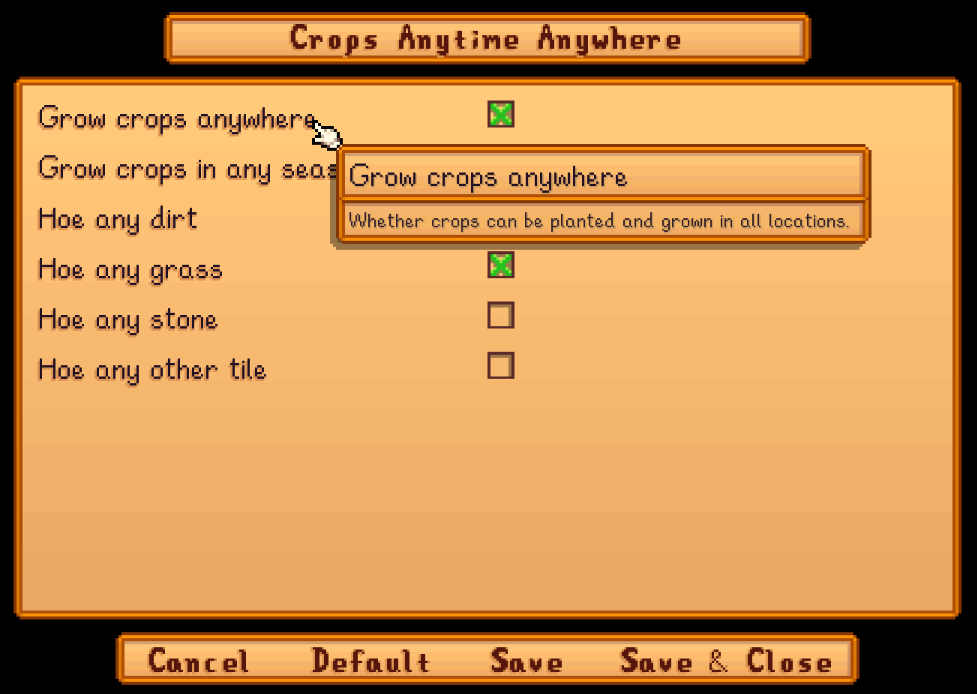

**Crops Anytime Anywhere** is a [Stardew Valley](http://stardewvalley.net/) mod that lets you grow
crops in any season and location, including on grass/dirt tiles you normally couldn't till. You can
optionally configure the seasons, locations, and tillable tile types.


## Contents
* [Install](#install)
* [Basic configuration](#basic-configuration)
* [Advanced configuration](#advanced-configuration)
* [Compatibility](#compatibility)
* [See also](#see-also)

## Install
1. [Install the latest version of SMAPI](https://smapi.io/).
2. [Install this mod from Nexus mods](https://www.nexusmods.com/stardewvalley/mods/3000).
3. Run the game using SMAPI.

Note that the mod doesn't change store inventories, so you can only buy crop seeds during their
usual seasons.

## Basic configuration
If you install [Generic Mod Config Menu][], you can click the cog button (⚙) on the title screen
or the "mod options" button at the bottom of the in-game menu to configure the mod. Hover the
cursor over a field for details.

> 

## Advanced configuration
The [in-game UI](#basic-configuration) only sets options which apply to all locations at once. For
more specific settings, you can edit the `config.json` file in the mod's folder using a text editor
like Notepad. The file is created the first time you run the game with the mod installed.

The config file has two main sections.

### `GrowthRules`
These rules decide where & when plants can be planted and grown (including crops, bushes,
and fruit trees). This is where you configure options like growing crops in locations that don't
normally allow them, or growing them out of season.

The mod will check each rule in the order listed, and apply the first rule which matches. These
options are always additive, so you can't _disable_ crops in a location that normally does allow
them.

For example:
```json
"GrowthRules": [
    // when indoors OR in the Secret Woods, plants grow in any season
    {
        "ForLocations": ["indoors", "Woods"],

        "CanPlant": true,
        "CanGrowOutOfSeason": true
    },

    // otherwise plants grow anytime except winter
    {
        "ForSeasons": ["Winter"],

        "CanPlant": true,
        "CanGrowOutOfSeason": true
    }
]
```

You can change these fields for each rule:

setting        | what it affects
:------------- | :------------------
`ForLocations` | The locations where this rule applies. This can contain internal location names (as shown by [Debug Mode](https://www.nexusmods.com/stardewvalley/mods/679)), `Indoors`, and `Outdoors`. Defaults to any location.
`ForLocationContexts` | The [location context IDs](https://stardewvalleywiki.com/Modding:Location_contexts#Location_context_IDs) where this rule applies. Defaults to any context.
`ForSeasons`   | The calendar seasons when this rule applies. This can contain `Spring`, `Summer`, `Fall`, and `Winter`. Defaults to any season.
`CanPlant`     | Whether you can always plant here while the rule is active.
`CanGrowOutOfSeason` | Whether plants will grow here even if they're out of season.
`UseFruitTreesSeasonalSprites` | When applied to a fruit tree, whether the fruit tree should match the calendar season when drawn even when producing fruits out of season. Default false.

## `TillableRules`
These rules decide which tile types you can till. This is where you configure options like tilling
grass tiles.

The mod will check each rule in the order listed, and apply the first rule which matches. These
options are always additive, so you can't _disable_ tilling a tile which is normally tillable.

For example:
```json
"TillableRules": [
    // can till any type on the farm
    {
        "ForLocations": ["Farm"],

        "Dirt": true,
        "Grass": true,
        "Stone": true,
        "Other": true
    },

    // can till dirt & grass anywhere else
    {
        "Dirt": true,
        "Grass": true
    }
]
```

You can change these fields for each rule:

setting        | what it affects
:------------- | :------------------
`ForLocations` | The locations where this rule applies. This can contain internal location names (as shown by [Debug Mode](https://www.nexusmods.com/stardewvalley/mods/679)), `Indoors`, and `Outdoors`. Defaults to any location.
`ForLocationContexts` | The [location context IDs](https://stardewvalleywiki.com/Modding:Location_contexts#Location_context_IDs) where this rule applies. Defaults to any context.
`ForSeasons`   | The calendar seasons when this rule applies. This can contain `Spring`, `Summer`, `Fall`, and `Winter`. Defaults to any season.
`Dirt`<br />`Grass`<br />`Stone`<br />`Other` | Whether to make all tiles of each type tillable.

## Compatibility
Compatible with Stardew Valley 1.6+ on Linux/macOS/Windows, both single-player and multiplayer. In
multiplayer mode, it must be installed by the main player to work correctly.

## See also
* [Release notes](release-notes.md)
* [Nexus mod](https://www.nexusmods.com/stardewvalley/mods/3000)

[Generic Mod Config Menu]: https://www.nexusmods.com/stardewvalley/mods/5098
