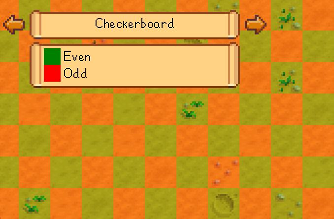

← [README](README.md)

This page helps mod authors integrate with Data Layers from their mods. **See the [main README](README.md) for other
info.**

## Contents
* [Access the API](#access-the-api)
* [Add a data layer](#add-a-data-layer)
  * [Usage](#usage)
  * [Color values](#color-values)
  * [Example](#example)
* [See also](#see-also)

## Access the API
Data Layers has a [mod-provided API](https://stardewvalleywiki.com/Modding:Modder_Guide/APIs/Integrations#Mod-provided_APIs)
you can use to integrate with your mods.

To access the API:

1. Copy [`IDataLayersApi.cs`](../IDataLayersApi.cs) into your mod code.
2. In [SMAPI's `GameLoop.GameLaunched` event](https://stardewvalleywiki.com/Modding:Modder_Guide/APIs/Events#GameLoop.GameLaunched),
   get the API:
   ```c#
   var dataLayers = this.Helper.ModRegistry.GetApi<IDataLayersApi>("Pathoschild.DataLayers");
   if (dataLayers is null)
       return; // Data Layers not installed
   ```
3. Call methods on the API (see below).

## Add a data layer
### Usage
After [accessing the API](#access-the-api), you can add custom data layers from the `GameLaunched` event:
```c#
dataLayers.RegisterLayer(id, GetName, GetTileGroups, UpdateTiles);
```

This method takes these arguments (see below for a working example):

<table>
<tr>
<th>argument</th>
<th>usage</th>
</tr>
<tr>
<td><code>id</code></td>
<td>

An ID for the layer, unique among the layers added by your mod. This doesn't need to be globally unique, since Data
Layers will prepend your mod ID automatically.

</td>
</tr>
<tr>
<td><code>name</code></td>
<td>

A translated display name for your data layer, which will be shown to players in-game.

</td>
</tr>
<tr>
<td><code>getTileGroups</code></td>
<td>

A method which registers the possible tile groups when the layer is loaded.

The method is called with one `addGroup` callback, which you can call to add a tile group. This takes four arguments:

argument       | usage
-------------- | -----
`id`           | The ID for this tile group within the layer.
`name`         | A translated display name for the tile group, which will be shown in the in-game legend UI.
`overlayColor` | The [color](#color-values) overlaid on tiles in this group.
`borderColor`  | _(Optional)_ The [color](#color-values) of the tile group's outer borders, or `null` for no border.

</td>
</tr>
<tr>
<td><code>updateTiles</code></td>
<td>

A method which gets the tile groups for the visible tiles while the layer is visible. This is called repeatedly while
the layer is open.

The method is called with four arguments:

argument       | usage
-------------- | -----
`location`     | The in-game location for which the layer is being drawn.
`visibleArea`  | A [rectangle](https://stardewvalleywiki.com/Modding:Common_data_field_types#Rectangle) of the area visible on-screen measured in tiles.
`visibleTiles` | The set of tile coordinates currently visible on the screen. You can either iterate the tiles, or use it to perform O(1) lookups.
`cursorTile`   | The tile position under the cursor.

This should return a lookup of tile positions within each group; that is, an `ILookup<string, Vector2>` whose key is
the tile group ID specified via `getTileGroups`.

</td>
</tr>
<tr>
<td><code>updatesPerSecond</code></td>
<td>

_(Optional)_ The default number of updates needed per second, or `null` for the default rate (currently 60/second).
This can be a decimal value (e.g. 0.5 to update every two seconds).

This sets the default value for the layer's configuration, so it's ignored for players who already have
configuration saved for it.

</td>
</tr>
<tr>
<td><code>updateWhenViewChanges</code></td>
<td>

_(Optional)_ Whether to update the layer by default when the player's tile view changes, regardless of the
`updatesPerSecond` value.

This sets the default value for the layer's configuration, so it's ignored for players who already have
configuration saved for it.

</td>
</tr>
</table>

## Color values
Color arguments in the API can be specified in any of these formats:

* A semantic color name which can configured by the player:
  * `yes` (e.g. covered/ready/enabled);
  * `no` (e.g. not covered/ready/enabled);
  * or `highlight` (e.g. the range for a held object).
* A [color string recognized by the game code](https://stardewvalleywiki.com/Modding:Common_data_field_types#Color).

Using a semantic color name is recommended where possible, so that players' color schemes are applied automatically
(e.g. to support colorblind players).

## Example
For example, let's create a 'checkerboard' data layer:  


To do that:

1. Add an `i18n/default.json` [translation file](https://stardewvalleywiki.com/Modding:Modder_Guide/APIs/Translation)
   to store your layer's display text:
   ```json
   {
       "layer.name": "Checkerboard",
       "layer.even": "Even",
       "layer.odd": "Odd"
   }
   ```
2. Set up the [`Pathoschild.Stardew.ModTranslationClassBuilder`](https://www.nuget.org/packages/Pathoschild.Stardew.ModTranslationClassBuilder)
   NuGet package.
3. Create a class for your layer logic:
   ```c#
   /// <summary>A data layer which shows a checkerboard tile pattern.</summary>
   internal static class CheckerboardLayer
   {
       /// <inheritdoc cref="GetTileGroupsDelegate" />
       public static void GetTileGroups(AddTileGroupDelegate addGroup)
       {
           addGroup(id: "even", name: I18n.Layer_Even, overlayColor: "yes");
           addGroup(id: "odd", name: I18n.Layer_Odd, overlayColor: "no");
       }

       /// <inheritdoc cref="UpdateTilesDelegate" />
       public static ILookup<string, Vector2> UpdateTiles(GameLocation location, Rectangle visibleArea, IReadOnlySet<Vector2> visibleTiles, Vector2 cursorTile)
       {
           return visibleTiles.ToLookup(GetTileGroup);
       }

       /// <summary>Get the tile group ID for a tile position.</summary>
       /// <param name="tile">The tile position.</param>
       private static string GetTileGroup(Vector2 tile)
       {
           return (tile.X + tile.Y) % 2 == 0
               ? "even"
               : "odd";
       }
   }
   ```
4. [Access the API](#accessing-the-api) and register your layer:
   ```c#
   dataLayers.RegisterLayer("checkerboard", I18n.Layer_Name, CheckerboardLayer.GetTileGroups, CheckerboardLayer.UpdateTiles);
   ```

That's it! If you launch the game and open the Data Layers UI, your new layer should appear in
the list.

## See also
* [README](README.md) for other info
* [Ask for help](https://stardewvalleywiki.com/Modding:Help)
