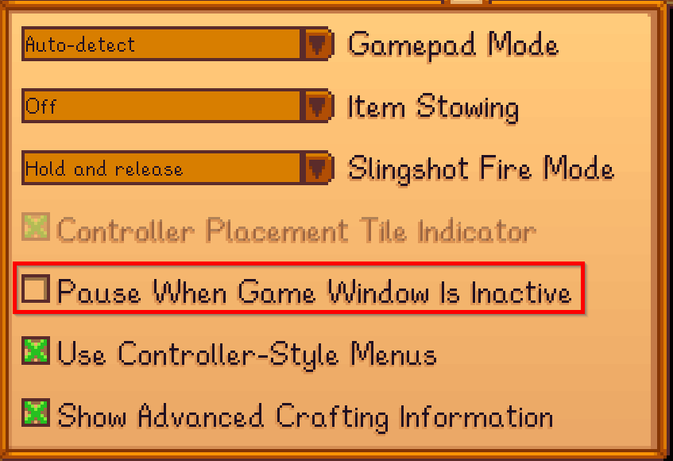

# Hot Reload

When using the recommended [asset registration](adding-ui-assets.md#adding-views) for views and sprites, StardewUI can watch for changes to asset files ([`.sml`](../framework/starml.md), `.png` and `json`) and update them immediately, even while the game is running and while the specific UI (menu, HUD, etc.) is open. This can be very useful for troubleshooting layout issues, making small tweaks toward a pixel-perfect UI, or simply using a playground for experimentation.

## Enabling Hot Reload

Once you have a [reference to the API](index.md#adding-the-api), turning on hot reload is a single method call:

```cs
viewEngine.EnableHotReloading();
```

A good place to do this is after the asset registrations, as in the [Example Mod](https://github.com/focustense/StardewUI/blob/v0.1.0/TestMod/ModEntry.cs#L36).

For best results, it is recommended to turn **off** the game setting labeled "Pause When Game Window Is Inactive":



Disabling this setting forces the game to process update ticks even while you are working in a separate window—such as your [code editor](editor-setup.md). This gives you truly _instant_ hot reload, without having to switch back to the game window.

### File Locations

Hot reload works on the **mod assets**; it does not know the original source of those assets.

!!! tip "Important"

    In order for hot reloading to work, make sure you are directly editing or copying your edits to the **deployed** files; that is, the file inside your `Stardew Valley\Mods\<ModName>` folder. See the [source sync](#source-sync) section below for a possible alternative, depending on your project setup.

### Source Sync :material-test-tube:{ title="Experimental" }

StardewUI can provide a built-in sync from your project assets directory to the deployed mod assets directory in order to work around the aforementioned limitation, and allow hot-reloading from your usual IDE or editor. There are two ways to enable this:

1. Use the extension from the `ViewEngineExtensions` class, copied with the `IViewEngine` definition. For "ordinary" project structures, this is the most convenient as it will auto-detect the source path based on the caller.

    ```cs
    viewEngine.EnableHotReloadingWithSourceSync();
    ```

2. Provide your own path to the `EnableHotReloading` method. Use this strategy if your project structure is unusual, or if the previous method does not work for any other reason.

    ```cs
    // Replace C:\Projects\MyMod with the actual path to your mod source.
    viewEngine.EnableHotReloading(@"C:\Projects\MyMod");
    ```

For either of the above to function, your source directory must have the same asset structure as the deployed mod. For example, if views have been registered for the path `assets/views`, then the source directory must be the directory containing `assets`, which in turn contains `views`.

This will almost always be the case for projects using [ModBuildConfig](https://www.nuget.org/packages/Pathoschild.Stardew.ModBuildConfig) that don't use their own custom build/deployment actions for assets, but you may need to tweak it if your project is set up differently.

!!! warning "Warning – Visual Studio Compatibility"

    Source sync currently has issues with Visual Studio which render it inoperable, due to VS creating temporary files and moving entire directories instead of simply writing to the source file. Other editors, including Visual Studio Code, should function correctly.

## Performance

When hot-reload is enabled, StardewUI must monitor your mod directory. While the overhead of doing so is generally low, having many mods do this at the same time(1) could cause lag/jank or other performance problems in game. To be polite to other modders, and players, it is recommended to turn off hot reload in the _released_ version of your mod, since players will not be using the feature themselves.
{ .annotate }

1.  The Framework API is partially scoped to each mod using it, and Hot Reload is a per-mod setting.

There are two ways to do this:

1. Remove the call to `EnableHotReloading()` before building your mod for release; or
2. Use [conditional compilation](https://learn.microsoft.com/en-us/dotnet/csharp/language-reference/preprocessor-directives#conditional-compilation). A simple and effective solution is to enable hot reloading in Debug mode only, as you will presumably be shipping the Release version.

    ```cs
    #if DEBUG
        viewEngine.EnableHotReloading();
    #endif
    ```

Conditional compilation is the recommended approach, as it is a permanent solution and avoids having hot-reloading accidentally enabled in a release build.